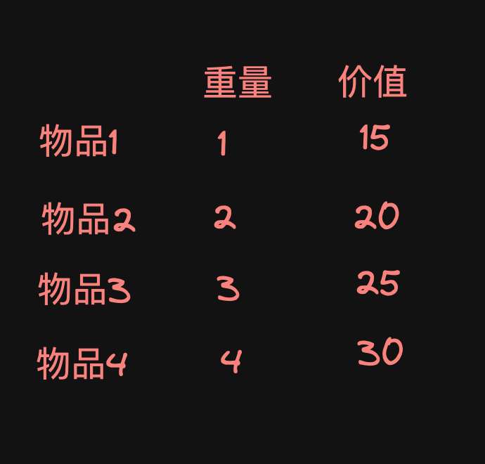
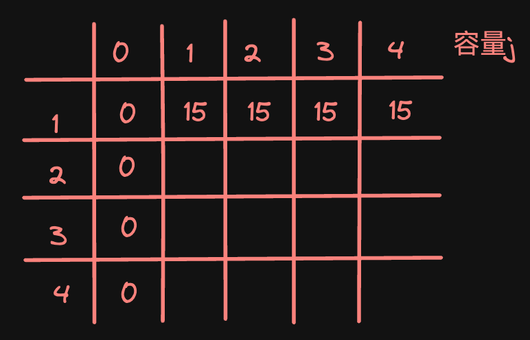

# 动态规划
## 五步骤
1. 理解dp[i][j]下标的含义；
2. 递推公式
3. dp的初始化
4. 遍历顺序
5. 打印dp数组

## 0-1背包问题

计算容量为n的背包所能装下的最大价值
### 1. dp项的含义
> (0～i)的物品任意选取放入容量为j的背包的最大价值

### 2. 递推公式
物品分为两种情况：选取与不选
- **不选**: `dp[i][j] = dp[i-1][j]` 容量不变，物品为（0～i-1）中选取
- **选取**: `dp[i][j] = dp[i-1][j-weight[i]] + price[i]`  容量减去选取物品的容量，然后（0～i-1）的物品在减去后的容量中选取

由于要求最大价值，所以要对比两种情况的最大值，因此递推公式为

`dp[i][j] = max(dp[i-1][j], dp[i][j] = dp[i-1][j-weight[i]] + price[i])`

这是二维数组的情况，我们还可以在空间上将其优化成一维数组

优化后的dp公式为
`dp[j] = max(dp[j], dp[j-weight[i]] + price[i])`

### 3. 初始化
背包问题的初始化主要在**第一行**与**第一列**

**第一行**也就是**0～j的容量**下只能选择**物品一**的情况，要考虑到物品一的容量是否大于当前容量j，

**第一列**也就是**容量为0**的情况选取物品，那其实就全都是0

**而如果是一维数组的话**

由于初识的价值不可能为负数，而且一维的递推公式中不选的情况有会对`dp[j]`本身进行比较，所以一维情况全部初始化为非负数即可，就全初始化为0，这样在对比的时候不会出现初始值把后面的值覆盖掉的情况

### 4. 遍历
遍历顺序没有什么影响，先遍历背包还是先遍历物品，实际上求的都是右下角的最大值。

**一维的情况要注意**
遍历的顺序得是先物品再背包

## 完全背包问题
> 完全背包问题实际上就是一个物品可以取多次的背包问题

完全背包和0-1背包的区别就在于容量层的遍历上
> 0-1背包的容量是从大到小遍历的，为的是让物品只取一次
> 完全背包则就是从小到大遍历，因为物品可以取多次

`for(let j=arr[i]; j<=weight; j++)`

然后完全背包在遍历的顺序上也有所讲究
- 先物品，再背包，求组合数
- 先背包，再物品，求排列数